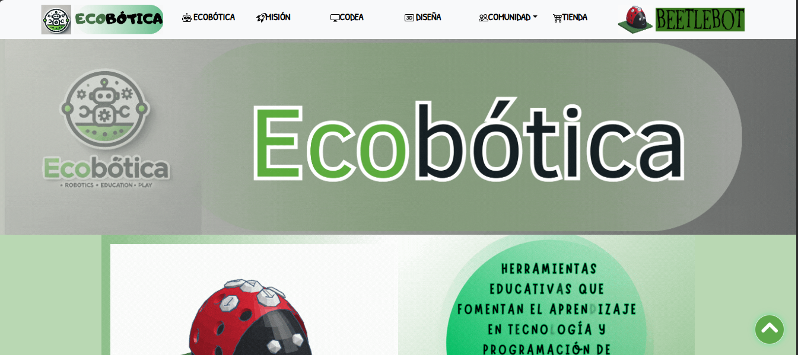

# Página Web de empresa Ecobótica 🎯

## Diseño de Prototipo educativo robótico.

### 1. Presentación de empresa

### 2. Nuestra visión y misión:

### 3. Prototipo educativo BeetleBOt

## Procedimiento

### Desarrolladora

| [ marynprdls](https://github.com/marynprdls) |
|-----------------|-----------------|
  

### Participantes del trabajo de Economia.
### - Acuña Quispe Diana.
### - Oliva Sáenz Marbel del Milagro.
### - Pasten Mariana.
### - Pozo Alvarez Sandra Roxana. 
### - Vicens Isabel. 
### - Vasquez Berenice.
